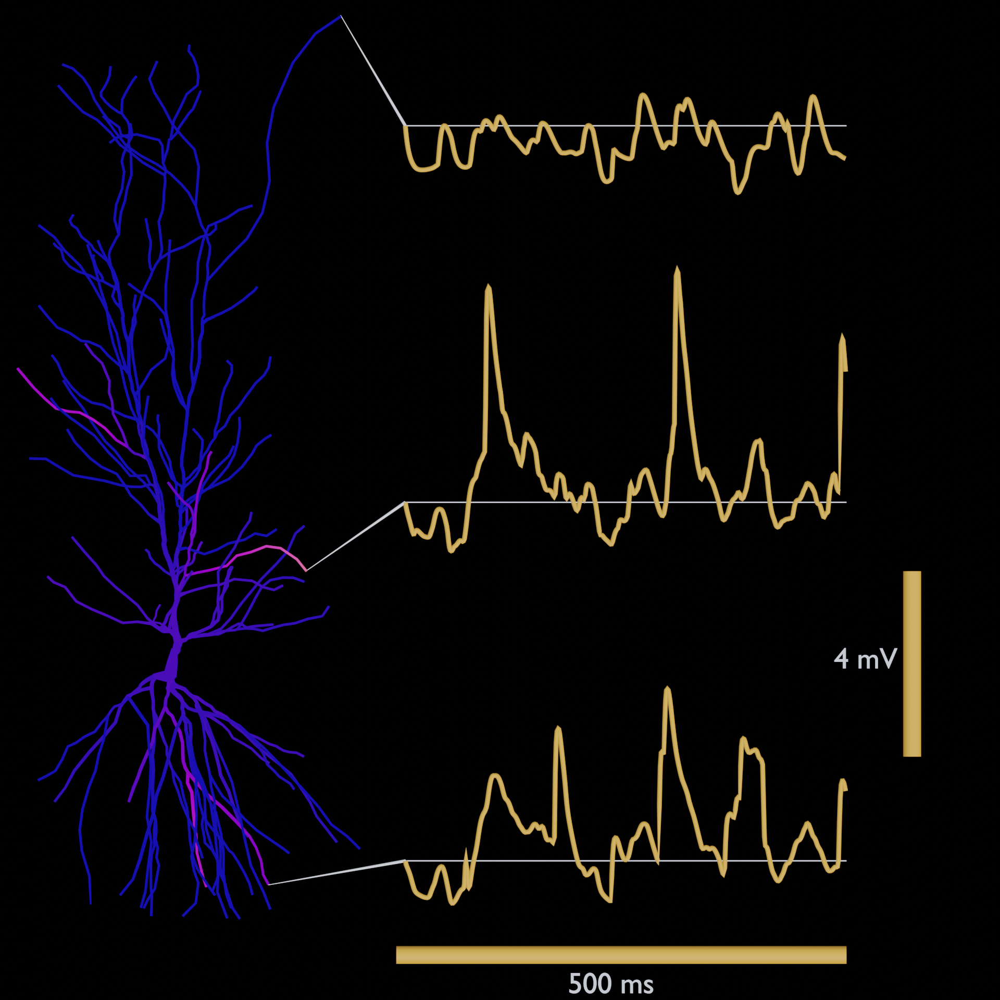
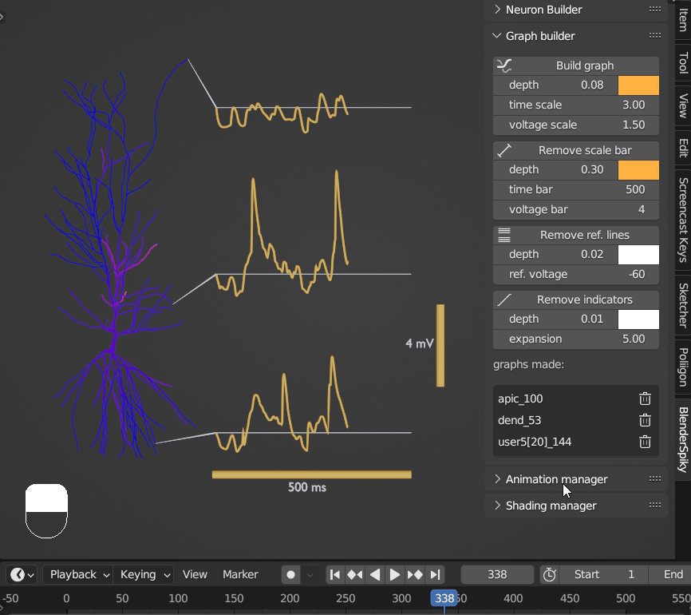
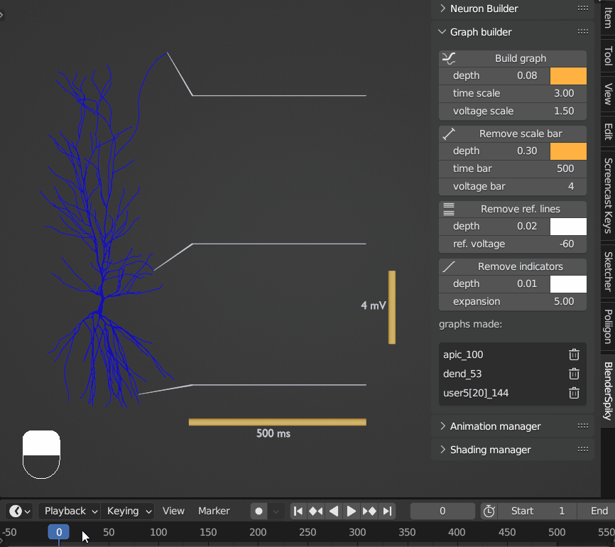
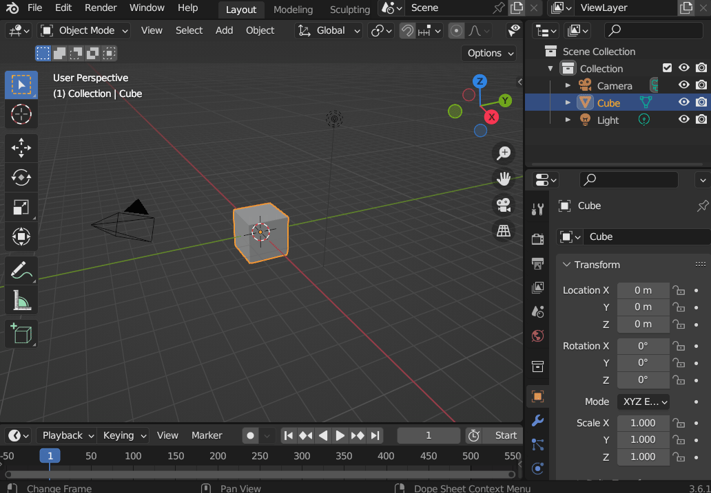

# BlenderSpiky ⚡⚡

This is **BlenderSpiky** adapted from [BlenderSpike](https://github.com/ArtemKirsanov/BlenderSpike/tree/main)

First of all, huge shoutout to ArtemKirsanov, he made the NEURON to Blender module.

## Graphing
I added the **new graphing system**:

Now you can get some great looking graphs within Blender! 
| Beautiful figures for in your paper| Or animations for your presentation|
|:-:|:-:|

The graph elements are very customizable and easy in use.
| Easily create and delete graphs| Fast playback speed| Easily customize your graphs|
|:-:|:-:|:-:|

## Installation
- First Install Blender: https://www.blender.org/download/

Then install the addon (see video below)
- Download the latest `BlenderSpiky.zip` from the Releases section 
- Add the addon in Blender

  
  
## Usage
Usage is intuitive! (see video below)
- Open a NEURON .pickle file [(for more info see: BlenderSpike ⚡)](https://github.com/ArtemKirsanov/BlenderSpike/tree/main)
- Click on a NEURON section in Blender
- Click on add graph
- Edit and custimize graph

  

